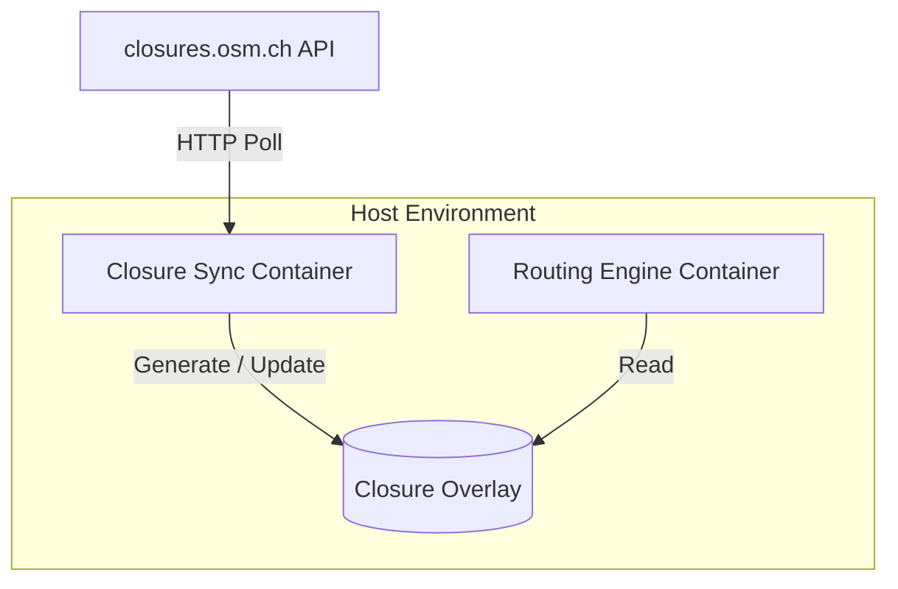
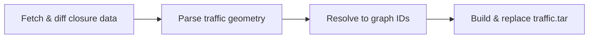

<link rel="stylesheet" href="style.css">

# GSoC 2026 — Victor Yanson

This document forms part of an application for Google’s Summer of Code 2026. It encompasses the applicants personal information and experience as well as a detailed project proposal. The project stems from a mentor project idea put forth by Simon Poole and can thus be found on the official OSM [GSoC 2026 project idea page](https://wiki.openstreetmap.org/wiki/Google_Summer_of_Code/2026/Project_ideas#Routing) under the ‘Routing’ category.

## General information

### Personal information

| Full name | Victor Alexander Marek Yanson |
| :--- | :--- |
| **Occupation** | Freelance Developer |
| **OSM account** | [VictorYanson](https://www.openstreetmap.org/user/VictorYanson) |
| **GitHub account** | [VictorYanson](https://github.com/VictorYanson) |
| **Email** | [victor.yanson@outlook.com](mailto:victor.yanson@outlook.com) |
| **LinkedIn** | [linkedin.com/in/victoryanson](http://www.linkedin.com/in/victoryanson) |

### Bio

Hi! My name is **Victor**. I’m a **23 year old freelance web developer** from the **Netherlands**. About a year ago I completed my **Bachelor's in Business Administration** after which I pivoted into freelance web dev. Working on various projects, I’ve been progressively working my way down the stack, having developed a recent interest in performance computing. Currently living between Nijmegen in the Netherlands and Barcelona, Spain, where my partner’s from. Additionally, I’m taking maths courses in preparation for a Master’s program in **Industrial Mathematics**.

### Relevant experience

#### Background

In total I’ve been programming for about **two years** now. Not coming from a technical background, I taught myself to program making small pet-projects. Since starting to code professionally, I’ve had a decent amount of exposure to FOSS tools although never having actually contributed myself until now. My early freelance work mainly consisted of CMS maintenance for non-technical clients. After a few projects however, I transitioned into writing full-stack web-based MVPs for aspiring entrepreneurs. Feel free to take a look at my [freelance page](https://www.nullonelabs.com/) built with Nuxt.js (although at this point it’s a bit outdated).

#### Languages and frameworks

My day-to-day language is **TypeScript**, although I’m very comfortable with **Python** as well. In addition, I’ve been familiarizing myself with **C++** and related low-level concepts. For most of my professional work I use frontend JavaScript libraries like **React** and **Vue** alongside their respective metaframeworks, **Next.js** and **Nuxt.js**. My full-stack projects have also allowed me to work with **SQL databases** in a professional setting, the main dialects being **Postgres** and **MySQL**. Lastly, my work has allowed me to get comfortable creating and deploying **Docker** containers on the **cloud**.

#### Projects

A big part of my professional projects have involved creating AI automation tools and chatbots alongside setting up and maintaining e-commerce pages. While these are my “bread-and-butter” projects, I see them as a consistent foundation for more specialized work later on.

A fundamental project for me has been the creation of a GIS-based app called **Focal Grid**. I was essentially put in charge of making the first version of a full-stack web app built to visualize Dutch public energy network data. This project introduced me to lots of core GIS concepts like **PostGIS**, **vector tiles**, and **GeoJSON**. Moreover, it sparked a genuine interest in GIS technology in me. This project took place during the end of last year, which was also the moment I discovered GSoC. I have gained permission from the client to share some details about the project which you can find [here](https://replace-with-acutal-url.com).

Another notable personal project of mine was a basic **driver behavior simulator** written in C++. The main goal of the project was to recreate realistic acceleration and braking behavior in a multi-car single lane situation. The driving behavior is defined by the [**Intelligent Driver Model**](https://en.wikipedia.org/wiki/Intelligent_driver_model) and for the visualization I used **RayLib**. Feel free to check out the project [here](https://replace-with-acutal-url.com).

### Community involvement

Firstly, I’d like to be frank about the fact that this will be **the only project**, and therefore OSM the only org, I’m planning on applying to this year. Throughout the last few months I’ve built up a comfortable amount of context and passion surrounding the issue at hand. I’ve had the chance to make contact with many of the project’s implied parties, and I honestly wouldn’t have the same confidence applying to another project.

That being said, I would describe my entry into the community as a pleasant learning experience. My very first contact with OpenStreetMap was through the use of the **JavaScript Mapbox Graphics Library** for Focal Grid, although this was admittedly more of a passive interaction. The first active contact with the community started once I had decided on OSM as my target org in January. Throughout the research of the project I have become more aware of maintainer expectations and open-source etiquette as a whole. I’m happy to say that I’ve received thoughtful guidance from **Simon Poole** and **Archit Rathod** on the context surrounding closures.osm.ch. Moreover, I’ve gotten to engage with the **Valhalla project** as well as the maintainers behind it (see [contributions](#valhalla) below). Lastly, I had a great exchange with **Eggie**, one of the main map editors and moderators for the Dutch OSM community.

#### Contributions

##### Valhalla

* [**PR #5884**](https://github.com/valhalla/valhalla/pull/5884)**:** Added Valhalla version logging to `docker-entrypoint` on startup. (**Merged**)  
* [**Issue #5757**](https://github.com/valhalla/valhalla/issues/5757#issuecomment-4061257896)**/[#5758](https://github.com/valhalla/valhalla/issues/5758#issuecomment-4061380869):** Technical follow-up on vector tile overzoom and live traffic layer implementation.

##### Closures.osm.ch

* [**PR #21**](https://github.com/Archit1706/temporary-road-closures/pull/21)**:** Fixed MacOS Docker build compatibility and startup crashes.  
* [**PR #22**](https://github.com/Archit1706/temporary-road-closures/pull/22)**:** Integrated `vitest` and added unit tests for Valhalla-related frontend logic.  
* [**Issue #25**](https://github.com/Archit1706/temporary-road-closures/issues/25)**/[#27](https://github.com/Archit1706/temporary-road-closures/issues/27):** Identified redundant `valhallaApi` code and gaps in query parameter documentation.

##### Ecosystem (triage & maintenance)

* **Graphhopper ([#3310](https://github.com/graphhopper/graphhopper/pull/3310#issuecomment-4063109510), [#3309](https://github.com/graphhopper/graphhopper/pull/3309#issuecomment-4063105628)):** PR linking and issue closure maintenance.  
* **OSRM ([#7138](https://github.com/Project-OSRM/osrm-backend/issues/7138#issuecomment-4062987857)):** Metadata/Labeling maintenance

##### Map data contributions

###### *Barcelona*

* [Changeset: 179776337](https://www.openstreetmap.org/changeset/179776337#map=19/41.413770/2.168254)  
* [Changeset: 179257968](https://www.openstreetmap.org/changeset/179257968#map=19/41.413602/2.169304)  
* [Changeset: 179135609](https://github.com/valhalla/valhalla/issues/5757#issuecomment-4061257896)

###### *Nijmegen*

* [Changeset: 178238893](https://www.openstreetmap.org/changeset/178238893#map=19/51.821180/5.861198)  
* [Changeset: 178237957](https://www.openstreetmap.org/changeset/178237957#map=19/51.834761/5.883084)  
* [Changeset: 178237030](https://www.openstreetmap.org/changeset/178237030#map=19/51.835896/5.838254)

### Availability

Without getting into too much detail, my personal situation allows me to focus this summer fully on professional and personal development ahead of my enrollment in my Master’s course. This means that I’m assured to have **at least 30 hours a week** available during the summer months to commit to GSoC. This would be in line with the **350 hour time scope** proposed by Simon. The only other summer activity of note is my self-study of math-related preparatory university materials.  

Additionally, I’m currently in the midst of a client project. However, the project is foreseen to finalize mid-April, after which I don’t have any other major projects lined up. 

Lastly, I’m honestly not quite sure yet what vacation plans will arise come summertime. Nevertheless, if any trips come up, I can assure they won’t be more than a **weekend getaway**. Of course, I will be sure to keep my mentor up to date might anything come up.

## Project proposal

### High-level summary

`closure-sync` is a **containerized sidecar service** designed to bridge the gap between **real-time road closures** on `closures.osm.ch` and **dynamic routing engines**. While meant for **engine-agnostic** extensibility, the initial implementation focuses on **Valhalla**. Here it provides a **pipeline** to translate **OpenLR** closure data into live Valhalla **traffic tiles**. The service emphasizes "drop-in" usability, allowing map providers to synchronize live road closures with **minimal configuration**.

### Context

#### What is closures.osm.ch?

`closures.osm.ch` is an **OSM platform** that collects and shares community-sourced **real-time road closure data**. It uses a **FastAPI** in combination with **PostGIS** as its backend and additionally offers a **Next.js** frontend for manual data manipulation and **closure-aware routing**. The project was created during **GSoC 2025** by Archit Rathod and is currently still in **beta**.

#### Proposed project idea

The project idea proposed by Simon Poole boils down to making closures.osm.ch **production-ready** by integrating it with **at least one routing engine**, enabling direct use of closure data in routing calculations.

### Problem

#### Current routing approach

As of now, `closures.osm.ch` handles closure-aware routing almost entirely **on the client**. The current mechanism fetches closure data from the backend to the Next app, passing the fetched closures as `exclude_location` parameters in routing requests to the Valhalla server.

#### Areas of concern

While the aforementioned routing mechanism was meant as a functional proof of concept, it presents several important limitations:

1. **Inefficient request flow:** Closure aware routing currently invloves **fetching** closure data from the backend, **processing** it on the client, and **injecting** it into the routing request. Running this flow on every request introduces latency and unnecessary overhead.
2. **Poor separation of concerns:** Having the client take charge fetching and normalizing closures means that every application using `closures.osm.ch` will need to reimplement its own version of closure-aware routing.  
3. **API limits:** The current implementation limits routing queries to [50 points](https://github.com/Archit1706/temporary-road-closures/blob/77c69fd799115272776a49d509d950787c857b87/frontend/app/closure-aware-routing/page.tsx#L149). This limits usability to small **bbox** areas whith few closure coordinates.  
4. **Routing accuracy:** The `exclude_location` parameter maps geometries to their closest graph edge in Valhalla during runtime. Ideally closures will get mapped directly to their corresponding edge IDs **before** the routing request happens.

### Solution

#### Considerations

During the elaboration of a possible technical solution, a handful of key considerations were kept in mind:

1. **Ease of use:** Having a “plug and play” setup for any combination of supported routing engines and host systems with minimal to no configuration.  
2. **Non-blocking:** Protecting the engine’s hot path from obstructions, even if the `closure-sync` service malfunctions.  
3. **Native performance:** Maintaining near-zero performance overhead during runtime.

#### Architecture

The project adopts a **sidecar deployment pattern** to fulfill the core requirements of ease of integration. In this model `closure-sync` runs as a lightweight and **independent container** alongside the primary routing engine within the **same host environment**. By decoupling the synchronization logic from the routing core the architecture ensures a **non-blocking app lifecycle.** 

The service functions by asynchronously ingesting data from `closures.osm.ch` and translating it into a **native closure overlay format** compatible with the routing engine's internal traffic APIs. 

#### Valhalla

Before moving on, it’s important to mention that for the GSoC project `closure-sync`’s **scope** will be limited to the Valhalla routing engine integration. For more information on the continuation of the project after GSoC see ‘[Continuation](?tab=t.lh72md2ytuu#heading=h.b3b327fctu5s)’.

The choice for Valhalla’s initial integration is thanks to its **widespread adoption** in the OSM community and its compatibility with the existing `closures.osm.ch` structures. Moreover, Valhalla’s **`pyvalhalla`** library offers an excellent high-level interface for graph interactions.

##### Approach

Having originally proposed the addition of helper functions in Valhalla’s core C++ logic, I was gently guided to the [Live Traffic API](https://valhalla.github.io/valhalla/mjolnir/historical_traffic/) by the [maintainers](https://github.com/valhalla/valhalla/discussions/5944). This steered the technical direction toward a **data-driven integration** rather than a structural one. By pivoting to Valhalla's native support for binary traffic tiles (.tar) `closure-sync` can influence routing costs at runtime without modifying the engine's source code.

#### Internal pipeline

`closure-sync`'s core loop can be summarized by the following the steps:

##### Fetch & diff extrenal closure data

Before requesting any data from `closures.osm.ch` the service finds out what area the core graph covers by extracting the **bbox** from the **Valhalla tile directory** (example: `/data/valhalla_tiles/'2/756/728.gph'`). Thereafter, `closure-sync` will poll `closures.osm.ch` on a user-configured **time interval** via HTTP by hitting its `GET /api/v1/closures` endpoint.

On a succesful response `closure-sync` will parse the JSON response and diff for any updated closure data. Ideally, throughout the project `closures.osm.ch` will be extended to accept a `updated_after=timestamp` query parameter to reduce network overhead. Nevertheless, `closure-sync` will require fallback diffing capabilities warranting an interal option. 

<!-- The result of this step is a **delta object** containing the relevant closures and their metadata. -->

##### Parse traffic geometry

Despite returned closure objects from `closures.osm.ch` containing both **GeoJSON** and **OpenLR** for closure geometries, OpenLR is generally preferred for Valhalla [edge resolution](https://github.com/valhalla/valhalla/discussions/5391#discussioncomment-13824018) due to it's ineherent **map-agnosticism**.

Furthermore, while it is true the Valhalla already has an internal [OpenLR decoder](https://github.com/valhalla/valhalla/blob/master/valhalla/baldr/openlr.h), however it unfortunatly doesn't have a **Python binding** yet. In the meantime, a **pip package** like `openlr` can be used for OpenLR string decoding.

<!-- This step finalizes by creating a **Location Reference Object**. -->

##### Resolve to graph IDs

At this point, we hit a fork in the road where two viable approaches can possibly be used. Firstly, `pyvalhalla` already features a [`trace_attributes` method](https://github.com/valhalla/valhalla/blob/master/docs/docs/api/map-matching/api-reference.md#trace-attributes-action) that takes a **GPS trace** or a set of **latitude/longitude positions** and returns the **attributes** of the graph edges along the trace including their `edge.id`. This call uses `meili` to map match the coordinates to the nearest valid graph edges introducing some **probabilistic** properties to the resolution, leading to an expected accuracy of [around 90%](https://github.com/valhalla/valhalla/discussions/5391#discussioncomment-13824028). This approach is reminiscent of the previously mentioned accurcy concerns in `closures.osm.ch`.

Alternativly, you can treat each **union of two succesive Location Reference Points** as a **separate routing request** to trace the closure along each graph edge, storing their corresponding IDs along the way. This effectivly increases the trace accuracy to [99%](https://github.com/valhalla/valhalla/discussions/5391#discussioncomment-13824028) by assuring the edges form a **valid contiguous road section**.

While the first option works to setup the **initial functionallity** and can increase **stability** by serving as a **fallback resolver**, the second option should ideally adopted as the **main approach**. 

##### Build & replace traffic.tar

<!-- * Traffic Tile Serialization
* File IO (python std lib) write to common volume
* Traffic Tiles `mmap`
* Data synchronisation: `Baldr` tile cache system -->

To create the initial live traffic skeleton binary we can call [`valhalla_build_extract` with the `--with-traffic` flag](https://github.com/valhalla/valhalla/discussions/4256?utm_source=chatgpt.com#discussioncomment-10829927) once at setup time. This will scaffold the tile structure with the corresponding headers and reserves zero bytes for the edges.

Unfortunatly, there's [no clean `pyvalhalla` method](https://github.com/valhalla/valhalla/discussions/4256?utm_source=chatgpt.com#discussioncomment-10892020) to inject the closure structs into the .tar skeleton. This means that we'll need to meticulously have to recreate the [traffic speed struct](https://github.com/valhalla/valhalla/blob/3.5.0/valhalla/baldr/traffictile.h#L52-L64) ourself using `struct` from the **Python standard library**.

To efficiently write the closures we firstly open a `mmap` for each traffic tile contained in the .tar binary. Then, we can write the structs to the correct location by calculating the [offset](https://github.com/valhalla/valhalla/discussions/4256?utm_source=chatgpt.com#discussioncomment-13769285). Finally, we flush and close the `mmap`. This repeats for every tile file in the .tar binary until completing the graph.

#### Limitations & opportunities
* OpenLR currently [not fully supported](https://github.com/Archit1706/temporary-road-closures/blob/77c69fd799115272776a49d509d950787c857b87/backend/app/services/openlr_service.py#L138-L139) by `closures.osm.ch` — I'd like to fix it
* I'd like to make the `openlr.h` python binding
* Interpreter version -> Compiled version

### Continuation

* To touch upon issues that might fall out of GSoC project scope.

#### General

- Performance improvement by [parallellisation](https://github.com/valhalla/valhalla/discussions/5391#discussioncomment-13824029) considering [edge IDs are not static](https://github.com/valhalla/valhalla/discussions/4256?utm_source=chatgpt.com#discussioncomment-13769285) and entire closure remaps are likely common.
- Multi-router Docker setup
- Closure speed segment breakpoint support
- traffic.tar race condition handling

#### Other server-based routing engines

- Graphhopper

#### Mobile applications

- Comaps and OSMand  
- Adjusted architecture   
  - single host env per routing app→shared public traffic feed  
  - Better suited for closures.osm.ch

### Schedule for project completion

…

### AI use

- GitHub Repo of this proposal
- Near-zero AI written content (all the bold text and formatting was by myself)
- Throughout the whole process AI has helped me managed the confusion of being a FOSS newbie
- I used AI to bounce off some ideas in areas where I'm less familiar
  - Example: file IO for .tar files where I couldn't easily find any documentation/previous discussions on the topic **AND** project scheduling