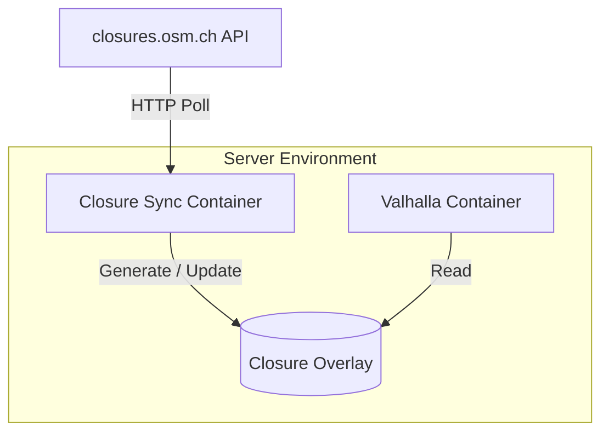

## Project proposal
### High-level summary
…
### Context
#### What is closures.osm.ch?
…
#### Proposed project idea
…
### Problem
…

### Solution
#### Considerations
…
#### Basic architecture

#### Internal pipeline
…
#### Additional information
…
#### Benefits & limitations
…
### Continuation
#### General
…
#### OSRM
…
#### Graphhopper
…
### Schedule for project completion
…
### AI use
…
